# e-commerce (PHP + MySQL)

## Introduction
This is a fully featured eCommerce website developed in PHP. It provides an intuitive and user-friendly platform for customers to browse and purchase products online. The website features an extensive product catalog, secure user authentication, advanced product search and filtering, shopping cart functionality, user profile management, credit card payment form, and integrated PayPal payment plus transportation details and process included as part of Paypal payment

## Features

### Customer / Guest
- Register & login
- Browse products (Shop)
- Product details page
- Add to cart, update quantity, remove items
- Checkout form + PayPal integration (requires your own credentials)

### Admin
- Dashboard overview
- Promotions management (create/edit/delete + images)
- Categories management (create/edit/delete)
- Products management (create/edit/delete + images)
- Orders management
- Profile + sign out

### Access Control
Admin pages are protected. If you are not an admin, you will see “You don't have permissions to view this page!” when opening dashboard sections.

## Screenshots
## Screenshots

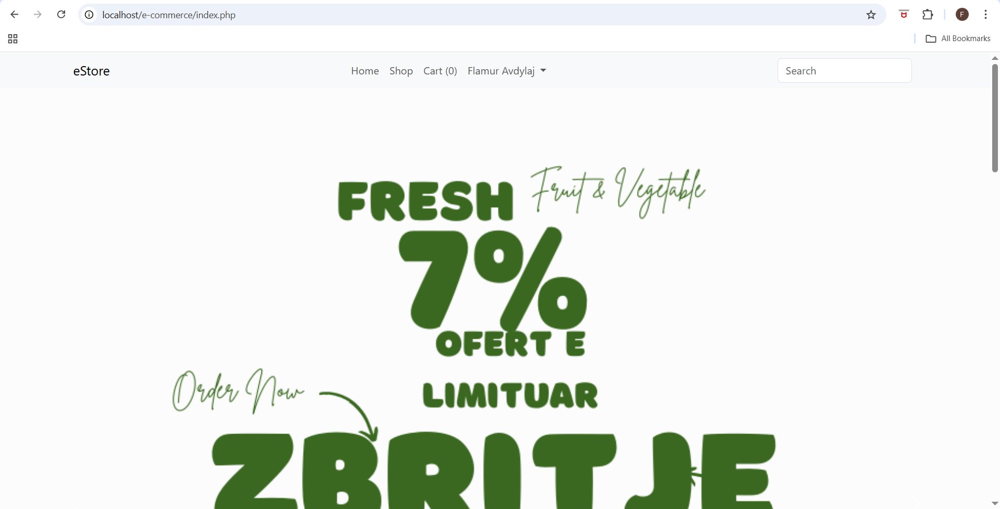
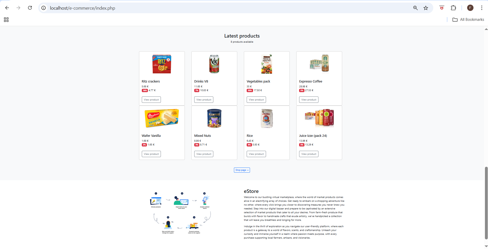

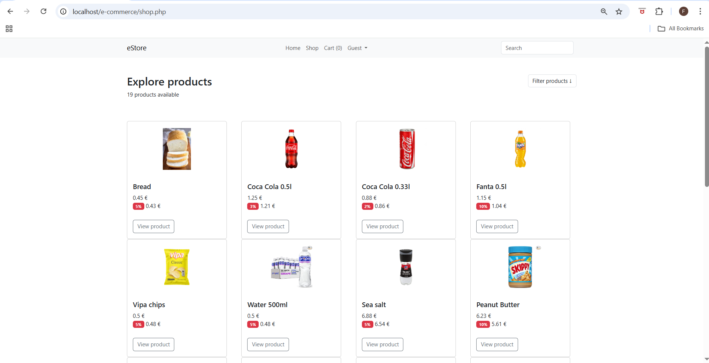
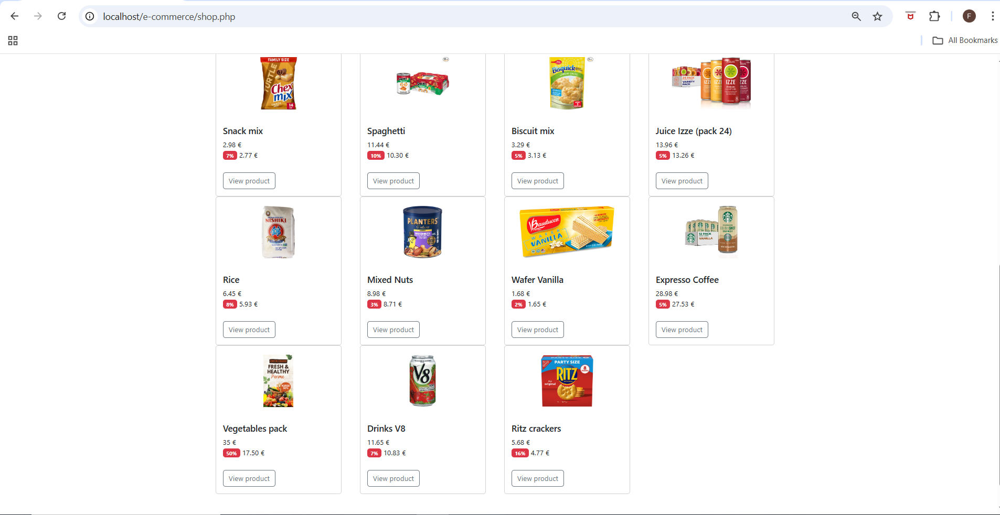
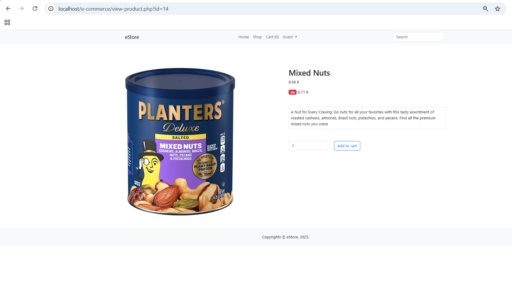
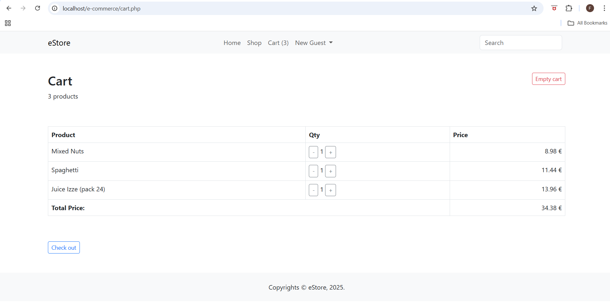
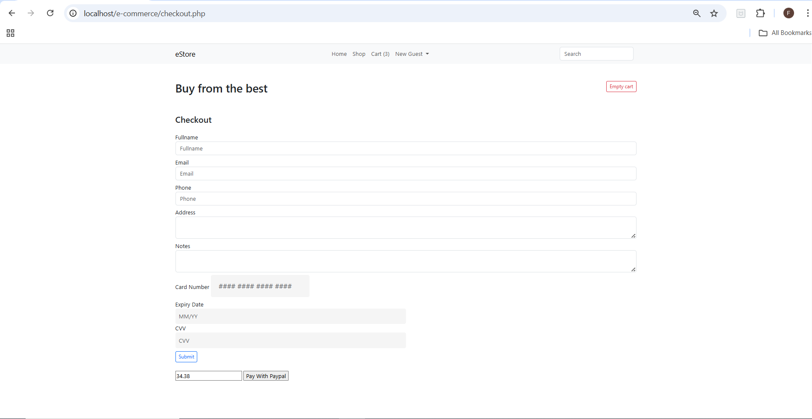

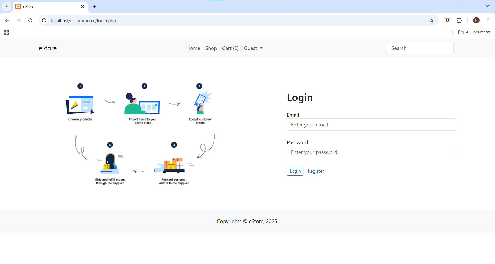
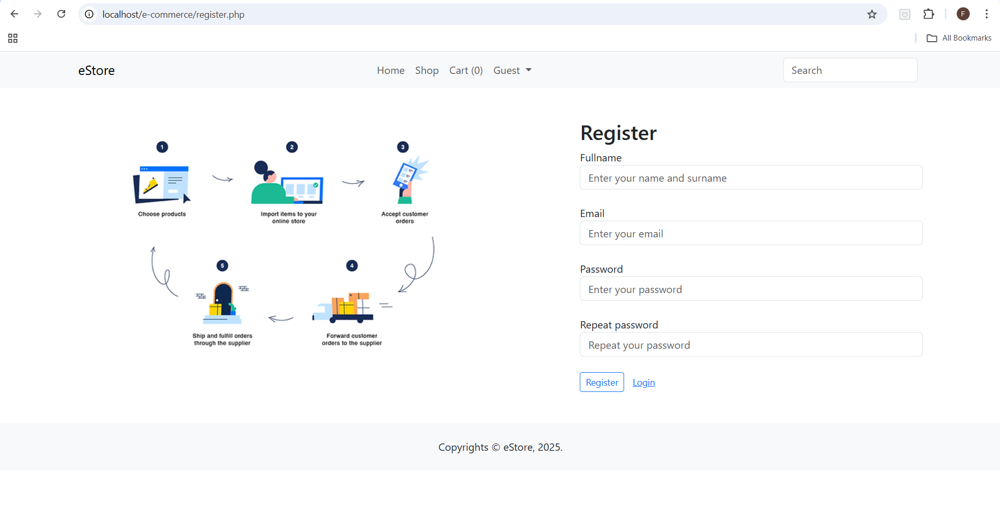
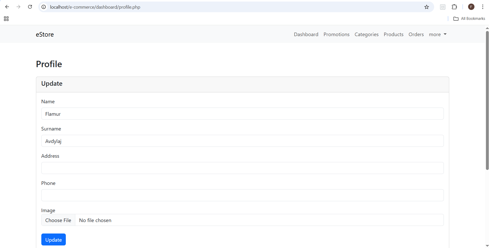

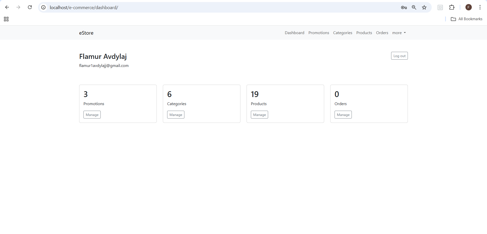
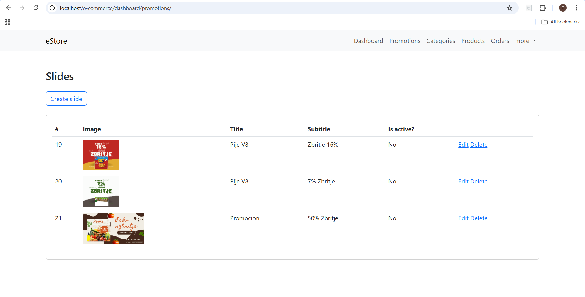
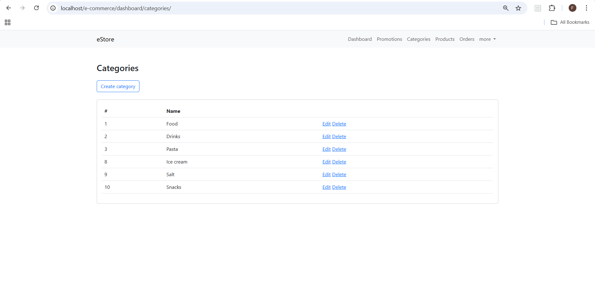
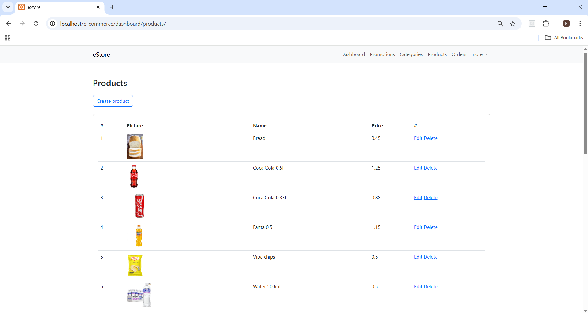


## Local Setup (XAMPP)

### 1) Copy project to htdocs
Place the project here:
`C:\xampp\htdocs\e-commerce`

Open in browser:
`http://localhost/e-commerce/`

### 2) Start services
In XAMPP Control Panel:
- Start **Apache**
- Start **MySQL**

### 3) Create and import database
1. Open phpMyAdmin: `http://localhost/phpmyadmin`
2. Create a database named: `estore`
3. Import the file: `estore.sql`

### 4) Environment / configuration
- Keep your real secrets in `.env` (do NOT commit it).
- Use `.env.example` as the template.

Typical values:
- DB host: `127.0.0.1`
- DB user: `root`
- DB password: empty (default in XAMPP)
- DB name: `estore`

### 5) Dependencies (if needed)
If the project uses Composer dependencies, run from the project folder:
```bash
composer install
